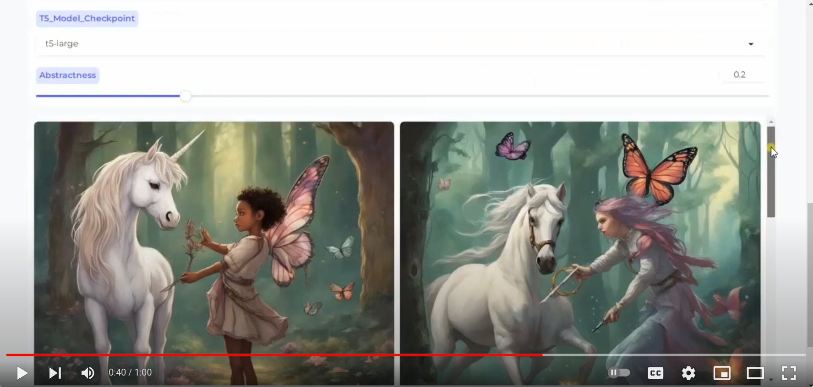

<div>
<div align='center'>
<h2 align="center"> Summagary: Document Summarization through Images </h2>
<h3 align="center"></h3>
</div>
<div>
<div align="center">
<div style="text-align:center">

</div>

###  [See Examples](https://www.youtube.com/watch?v=mFMkE2waYGQ) | [Use in Huggingface](https://huggingface.co/spaces/fittar/summagary)

</div>

## Overview
Summagary is a tool designed to summarize lengthy documents into concise visual representations. It is capable of handling diverse content, including abstract, figurative language, and concrete scenarios.

## How to Use
### Installation
To use Summagary, follow these steps:

1. **Clone the Repository**
    ```bash
    git clone git@github.com:Hazel1994/summagary.git
    ```
    or
    ```bash
    git clone https://github.com/Hazel1994/summagary.git
    ```
2. **Create a virtual environment**
   ```bash
   cd summagary
   virtualenv env
   source env/bin/activate
   ```
3. **Install Dependencies**
    ```bash
    pip install -r requirements.txt
    ```

### Running Summagary
Once installed, you can use Summagary through the command line:

```bash
python app.py
```
This will print two URLS such as

```bash
Running on local URL:  http://127.0.0.1:7860
Running on public URL: https://7041c3f5bd1a53072e.gradio.live
```
Simply copy and paste either one into your browser, using the public URL, you can share the program with your friends while utilizing your computational resources.

## Examples
Below are examples showcasing the original document and the corresponding generated image summary for various types of content.
<p align="center">
  <a href="https://www.youtube.com/watch?v=mFMkE2waYGQ">
    
  </a>
</p>

## How It Works
Summagary employs advanced algorithms and image generation techniques to process textual data and condense it into visual representations. The process involves:

1. **summarization:** Summagary recursively summarizes the input document, until it reaches a few sentences.
2. **Prompt Generation:** The summarized version of the document is then passed to [ViPE]{} for prompt generation.
3. **Image Generation:** Different prompts are fed into SDXL for visualization.

## Contact
<a href='https://fittar.me/'> Hassan Shahmohammadi </a>&emsp;

## License
This project is licensed under the [MIT License](LICENSE).
